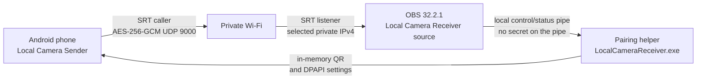
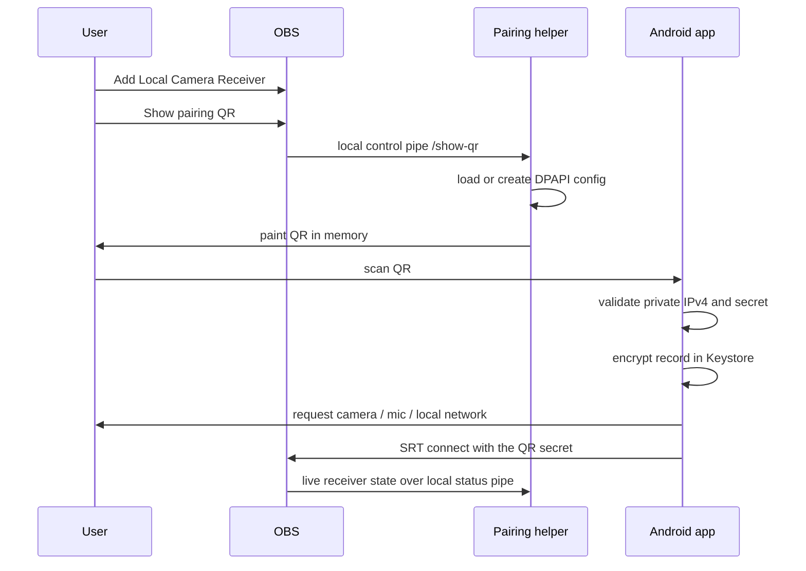
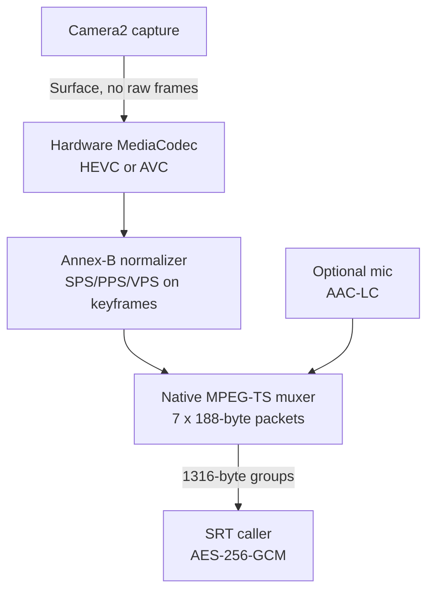
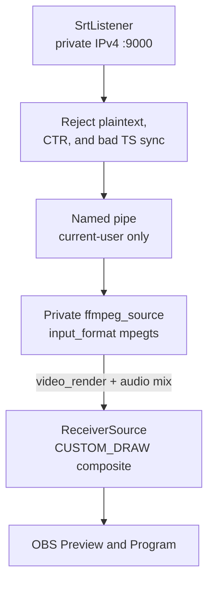
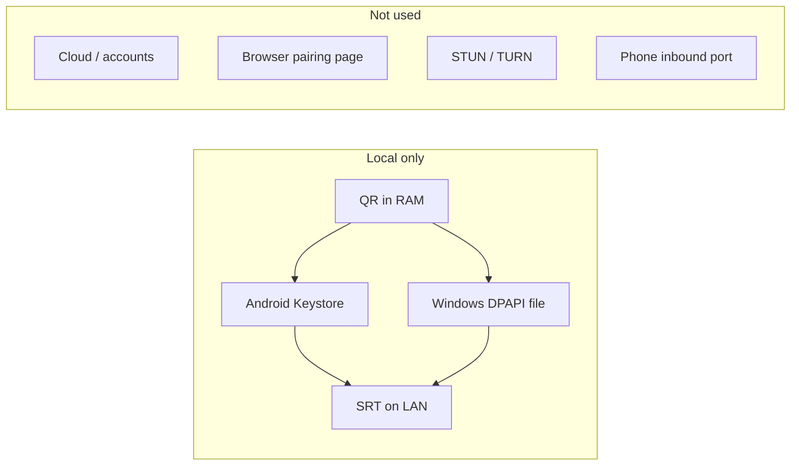

# Local Camera Sender

> Turn an Android phone into an encrypted, local-network camera source for OBS
> Studio—without a cloud account, analytics SDK, or browser pairing flow.


Local Camera Sender is a two-part, local-Wi-Fi camera system:

| Part | What it does | Technology |
|---|---|---|
| Android sender | Captures camera and optional microphone, encodes locally, and calls the paired PC | Kotlin, Camera2, MediaCodec, C++/NDK, SRT 1.5.6 |
| OBS receiver | Authenticates, receives, decrypts, and exposes synchronized video/audio as an OBS input source | C++20, libobs APIs, SRT 1.5.6, Botan 3.12.0 |

## Download

The ready-to-use files are kept at the repository root. Every successful `main`
CI build refreshes both binaries, `SHA256SUMS.txt`, the hashes below, and the
CLI's pinned installer hash only after Android, Windows, and CLI validation pass.
Pull requests publish downloadable workflow artifacts without replacing these
canonical root files.

| Platform | Download | SHA-256 |
|---|---|---|
| Android | [LocalCameraSender.apk](./LocalCameraSender.apk) | `023BE34575170155A25717FF8A63836410F0DF6313F863AD6667AB4984D45E4E` |
| Windows / OBS | [LocalCameraReceiverSetup.exe](./LocalCameraReceiverSetup.exe) | `11C4298F3B2A9A396ED78742B493D87B1161CD3670D12952E9F68822B5A3B95D` |

The APK is signed with the repository's stable, development-only CI certificate;
it is not a production trust identity. The Windows installer is not Authenticode
signed because no private production certificate is part of this repository.
Windows may show an unknown-publisher or reputation warning. Verify the hashes
above before running either artifact. If an older APK was signed by a different
local development certificate, Android may require one uninstall before moving
to the stable CI-signed builds.

## Quick start

### Instant Launch (via npx / npm)
Run directly without manual download:
```bash
npx local-camera-receiver
```
Or install globally:
```bash
npm install -g local-camera-receiver
local-camera-receiver
```

### Manual Setup
1. Install or update **OBS Studio 32.2.1 x64** on Windows 10 or 11.
2. Run `LocalCameraReceiverSetup.exe` (or use `npx local-camera-receiver`) and keep the Private-network firewall task selected.
3. In OBS, choose **Sources + → Local Camera Receiver**.
4. Open that source's properties and choose **Show pairing QR**.
5. Install and open `LocalCameraSender.apk` on Android 10 or newer, then scan
   the QR and allow the requested camera, microphone, and local-network access.
6. Streaming starts automatically after the scan. OBS shows the authenticated
   phone model and the video/audio source as soon as the secure connection is ready.

The receiver remembers its encrypted settings. Choose **Finish & run in
background** after pairing; the tray helper then starts with Windows, so normal
use does not require repeating setup. Receiver state is propagated to the helper
and OBS as the connection moves through listening, authenticating, streaming,
reconnecting, or failure. The phone microphone is enabled by default and can be
turned off before pairing.

Each new QR replaces the previous secret. The QR is valid for ten minutes; the
receiver credential lasts at most one year.

## Privacy and security

- No cloud relay, user account, web pairing page, telemetry, or analytics SDK.
- The receiver binds a selected private IPv4 interface rather than `0.0.0.0`.
- SRT preview AEAD mode 2 with AES-256-GCM and secured key states is mandatory.
- Plaintext and AES-CTR downgrade attempts are rejected.
- Windows DPAPI encrypts the complete receiver record for the current user.
- The native pairing app paints the QR directly in memory—no QR image, secret,
  URL, or passphrase is written to the clipboard, browser, or logs.
- OBS and the pairing helper use a current-user-only local message pipe. It
  rejects remote clients and accepts only bounded protocol messages for showing
  the QR or propagating receiver state; pairing secrets never travel on it.
- The phone sends only a sanitized, non-unique model label for OBS status. It is
  trusted and displayed only after the required encrypted connection is secured.
- The optional firewall rule is restricted to `obs64.exe`, UDP 9000, Private
  profiles, and the local subnet.
- SRT payloads, MPEG-TS groups, queues, credential lifetimes, labels, and network
  addresses are independently bounded and validated on both ends.

See [the Windows receiver guide](./pc/README.md),
[the mobile security review](./mobile/docs/security-review.md), and
[the dependency record](./mobile/docs/dependency-licenses.md) for the precise
trust boundaries and redistribution details.

## Repository layout

```text
mobile/   Android application, native sender, tests, and platform notes
pc/       OBS plugin, pairing app, installer, native tests, and research notes
LICENSES/ Third-party license texts used by the distributable application
```

Downloaded SDKs, extracted toolchains, CMake/Gradle outputs, emulator data,
local credentials, and temporary archives are deliberately ignored. The APK
and installer are the only root binaries intended for version control.

## Build from source

### Android

Prerequisites: JDK 17, Android SDK/API 37, Build Tools 37.0.0, NDK 29.0.14206865,
and a connected/emulated API 37 device for instrumentation tests.

```powershell
Set-Location mobile
.\gradlew.bat --no-configuration-cache clean testDebugUnitTest lintDebug connectedDebugAndroidTest assembleDebug assembleRelease
```

Gradle dependency verification is locked with SHA-256 checksums. The release
runtime graph and production APK are documented in
[`mobile/docs/dependency-licenses.md`](./mobile/docs/dependency-licenses.md).
The canonical root APK is additionally aligned, signed, and certificate-verified
by CI using the stable development identity documented in
[`mobile/signing/README.md`](./mobile/signing/README.md).

### Windows / OBS

Prerequisites: Visual Studio 2022 with MSVC v143 and a Windows SDK, CMake 3.30+,
Python 3, and Inno Setup 6.

```powershell
.\pc\scripts\build-windows.ps1
```

The script hash-verifies pinned OBS 32.2.1 headers, builds the private static
SRT/Botan stack, treats project warnings as errors, runs native tests, discovers
the installed Visual C++ x64 runtime, and recreates
`LocalCameraReceiverSetup.exe` at the root. It does not download or redistribute
OBS binaries.

## Validation status

The Android gate passed 43 JVM tests, strict lint, 7 API 37 emulator tests, and
the minified release build. Windows builds with warnings as errors and passes
its native configuration/DPAPI/queue/network/source-contract/control-protocol test suite. The
pairing GUI was exercised as a real app to verify physical-adapter selection,
encrypted settings, in-memory QR rendering, tray/background behavior, and the
finished-state UI.

The OBS registration bug found in the original 0.1.0 install is fixed in the
0.2.0 installer: the composite wrapper no longer advertises an invalid direct
audio flag, while audio still comes from its active FFmpeg child. The receiver
custom-draws and enumerates that child, defaults to software decoding for the
most reliable HEVC/SRT path, and exposes hardware decoding as an optional source
setting. Live SRT state is also forwarded to the pairing helper instead of
leaving the QR window on a stale ready message.

Hardware-dependent behavior still requires testing on each target phone and
network: 4K/60 capability, HEVC support, screen-off camera survival, OEM power
management, thermal limits, sustained A/V sync, reconnect, and long-run loss
recovery. A compile or rendered QR alone is not evidence for those lifecycle
gates.

## How it works

Nothing leaves the local Wi-Fi. The phone is always the caller. The PC only
listens on one private IPv4 address. Pairing is a QR you scan once; after that
the same encrypted secret is used for every SRT session.

### 1. Pieces



### 2. Pairing

The helper paints the QR in memory. The payload is a short-lived URI: receiver
id, private host, port 9000, 32-byte secret, expiries. The phone stores that
record in Android Keystore. The PC stores the same record with DPAPI for the
current Windows user. A new QR replaces the old secret.



### 3. Phone sender

Camera frames never become a Kotlin bitmap. Camera2 writes into a MediaCodec
input surface. The encoder emits Annex-B access units (HEVC preferred, AVC
fallback). Those bytes go across JNI into an MPEG-TS muxer, then out an SRT
caller socket.



### 4. OBS receiver

OBS does not decode SRT itself. The plugin listens, checks every TS group, and
writes to a private named pipe. A hidden `ffmpeg_source` child reads MPEG-TS
from that pipe. The composite parent custom-draws the child texture and copies
its audio mix. Software decoding is the reliability default; hardware decoding
can be enabled in source properties when the local GPU/driver path is known-good.



### 5. What is never on the wire as a service



## License

Application code is distributed as `GPL-2.0-or-later`. That expression is
intentional because the Android/Kotlin runtime graph contains Apache-2.0 code,
which is compatible through GPLv3 rather than strict GPLv2-only. The requested
unmodified GPLv2 text remains in [`LICENSE`](./LICENSE); complete third-party
terms and notices are preserved under [`LICENSES/`](./LICENSES/), the vendored
source trees, and the installed Windows plugin bundle.
